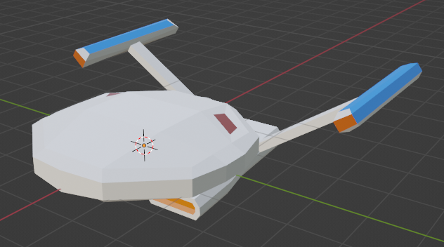
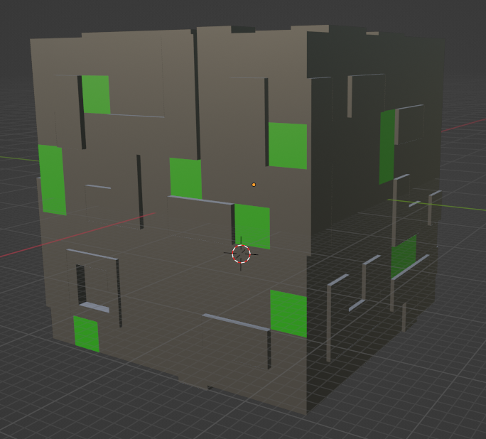
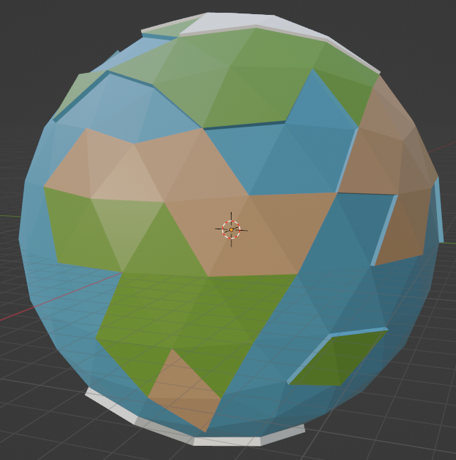
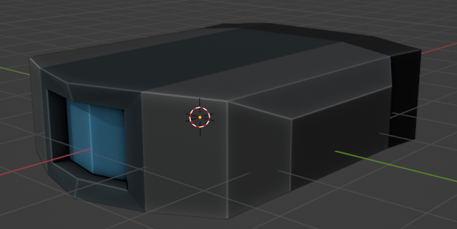
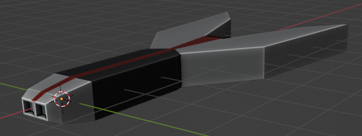
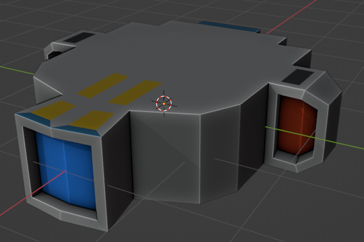
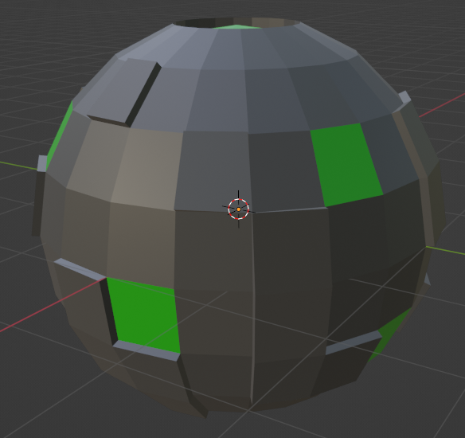
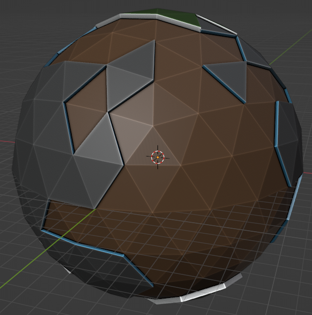

# Star Trek Borg Battle

Name: Rianlee Gabriel Pineda

Student Number: C18301026

Class Group: TU856 (DT228)

# Description
This is a low-poly recreation of the Borg battle from Star Trek: First Contact in Unity. All models were created using Blender.

The story will mimic the following video:

[](https://www.youtube.com/watch?v=D7KCb-O20Fg)

# Video Demonstration

# Instructions for use

# Event Summary
## Scene 1
1. Picard gets notified that Starfleet has engaged the Borg.
2. The Borg threatens to assimilate Earth.
3. The Enterprise goes to Earth at maximum warp to aid the fleet who are losing the battle.

## Scene 2
1. Borg cube is seen heading for Earth.
2. 3 shots fired by the Starfleet hit the Borg cube.

## Scene 3
1. The Starfleet ships attack the Borg cube.
2. The USS Defiant shoots at the cube, but then gets too close and gets shot down by the Borg cube.
3. The USS Defiant is heavily damaged, on fire and slows down.
4. The rest of the ships continue to struggle against the Borg cube.

7. The Enterprise arrives to aid the other ships in their fight against the Borg cube.
8. Picard takes command of the fleet and orders the ships to target their weapons to a specific part of the Borg cube.
9. Before the Borg cube blows up, a Borg sphere is released.
10. The Borg sphere heads for Earth.
11. The Enterprise pursues the Borg sphere.
12. Worf boards the Enterprise.
13. Temporal vortex is created by the Borg sphere to travel back in time.
14. The Enterprise gets caught in the temporal vortex.
15. The Borg assimilates Earth from the past and changes history.
16. To reverse the damage caused by the Borg, the Enterprise follows the Borg sphere through the vortex.
17. The Borg sphere starts attacking Earth.
18. In response, the Enterprise fires quantum torpedoes at the sphere.
19. The Borg sphere blows up.

# How it works
## Scene 1
### Movement of the Enterprise
In this scene, you can see the Enterprise move through space. It is a GameObject that has the [ShipBehaviour.cs](https://github.com/c18301026/GE2_Assignment/blob/main/Borg%20Battle/Assets/Scripts/ShipBehaviour.cs) script attached. This script contains attributes relating to a ship's states, physics and methods for how the ship will move towards a target.
#### ShipBehaviour.cs
```C#
using System.Collections;
using System.Collections.Generic;
using UnityEngine;

public class ShipBehaviour : MonoBehaviour
{
	// Ship states
	public bool seeking;
	public bool arriving;
	public bool followingPath;

	public Transform target;
	public Path path;
	public float maxSpeed;

	private Vector3 force;
	private Vector3 acceleration;
	private float mass = 1f;
	private Vector3 velocity = new Vector3(0, 0, 0);
	private float speed;
	private float banking = 0.1f;
	private float damping = 0.1f;
	private float slowingDistance = 40f;
	private float waypointDistance = 3f;

	void Seek(Vector3 targetPos)
	{
		Vector3 toTarget = targetPos - transform.position;
		Vector3 desired = toTarget.normalized * maxSpeed;

		force = desired - velocity;
		acceleration = force / mass;
		velocity += acceleration * Time.deltaTime;
		transform.position += velocity * Time.deltaTime;
		speed = velocity.magnitude;

		if(speed > 0)
		{
			Vector3 tempUp = Vector3.Lerp(transform.up, Vector3.up + (acceleration * banking), Time.deltaTime * 3.0f);
			transform.LookAt(transform.position + velocity, tempUp);
			velocity -= (damping * velocity * Time.deltaTime);
		}
	}

	void Arrive(Vector3 targetPos)
	{
		Vector3 toTarget = targetPos - transform.position;
		float distance = toTarget.magnitude;

		if(distance == 0.0f)
		{
			force = Vector3.zero;
		}
		else
		{
			float ramped = (distance / slowingDistance) * maxSpeed;
			float clamped = Mathf.Min(ramped, maxSpeed);
			Vector3 desired = clamped * (toTarget / distance);
			force = desired - velocity;
		}

		acceleration = force / mass;
		velocity += acceleration * Time.deltaTime;
		transform.position += velocity * Time.deltaTime;
		speed = velocity.magnitude;

		if(speed > 0)
		{
			Vector3 tempUp = Vector3.Lerp(transform.up, Vector3.up + (acceleration * banking), Time.deltaTime * 3.0f);
			transform.LookAt(transform.position + velocity, tempUp);
			velocity -= (damping * velocity * Time.deltaTime);
		}
	}

	void FollowPath()
	{
		Vector3 nextWaypoint = path.Next();

		if(!path.looped && path.IsLast())
		{
			Arrive(nextWaypoint);
		}
		else
		{
			if(Vector3.Distance(transform.position, nextWaypoint) < waypointDistance)
			{
				path.ToNext();
			}

			Seek(nextWaypoint);
		}
	}

	void FixedUpdate()
	{
		if(seeking)
		{
			Seek(target.position);
		}
		else if(arriving)
		{
			Arrive(target.position);
		}
		else if(followingPath)
		{
			FollowPath();
		}
	}
}
```
For most of the scene, the Enterprise isn't actually following (seek/arrive/path following) anything in particular. The movement is controlled by a "scene director", an empty GameObject that has a [unique script](https://github.com/c18301026/GE2_Assignment/blob/main/Borg%20Battle/Assets/Scripts/Scene1Director.cs) attached to it for every scene that controls how the events play out in specific scene. It is only until the end of the scene (when Picard says "Engage!") where the Enterprise actually seeks a target (it is a sphere, but its Mesh Renderer component has been disabled). The purpose of the target sphere is to make the Enterprise turn around when Picard decides to help the Starfleet's battle against the Borg cube.
#### These are some attributes found at the top of the scene 1 director script. They are related to the physics and states of the Enterprise ship, e.g., boolean flags that state when the ship should turn around.
```C#
// Attributes related to the ships/physics
private GameObject enterprise;
private GameObject target;
private Camera camera;
private ShipBehaviour enterpriseBehaviour;
private float targetSpeed = 5f;
private bool lookAt = false;
private bool turningAround = false;
private bool goingBack = false;
private bool faster = false;

// ...other attributes not related to the movement of the Enterprise
```
#### The Awake() method is called to initialise some variables and get a reference to the Enterprise ship and its target.
```C#
void Awake()
{
	// Ship/physics variables
	enterprise = GameObject.FindWithTag("Enterprise");
	target = GameObject.FindWithTag("Target");
	camera = Camera.main;
	enterpriseBehaviour = enterprise.GetComponent<ShipBehaviour>();
	enterpriseBehaviour.target = target.transform;
	enterpriseBehaviour.maxSpeed = targetSpeed;

	// ...the rest of the Awake() method isn't related to the movement of the Enterprise
}
```
#### In the Start() method, a method called TurnAround() is invoked after 111.5 seconds has passed in the first scene. This is when the target sphere turns around. Once the target sphere turns around, the Enterprise is already seeking it and therefore, the Enterprise also turns around.
```C#
void Start()
{
	// ...the code above the invoke method relates to coroutines for changing the camera angles, i.e., not related to the movement of the Enterprise ship

	Invoke("TurnAround", 111.5f);
}
```
#### The else statement shows that in normal cases, i.e., most of the scene, the Enterprise ship is technically not seeking the target. Instead, its position is changed at an equal pace to the target sphere. Once the turningAround flag/state has been turned on in the first if statement, the Enterprise ship begins to actually seek the target sphere. The target sphere moves in the X-axis as a way to make the Enterprise change its direction.  The else if statement shows the target (meaning the Enterprise also) going in the opposite direction it was originally going in.
```C#
void FixedUpdate()
{
	if(turningAround)
	{
		enterpriseBehaviour.seeking = true;
		target.transform.position += new Vector3(targetSpeed * Time.deltaTime, 0, 0);
	}
	else if(goingBack || faster)
	{
		target.transform.position += new Vector3(0, 0, -targetSpeed * Time.deltaTime);
	}
	else
	{
		enterprise.transform.position += new Vector3(0, 0, targetSpeed * Time.deltaTime);
		target.transform.position += new Vector3(0, 0, targetSpeed * Time.deltaTime);
	}

	// ...below is code not related to the movement of the Enterprise
}
```
#### These methods give more context to the FixedUpdate() code above.
```C#
void TurnAround()
{
	turningAround = true;
	Invoke("GoBack", 0.5f);
}

void GoBack()
{
	turningAround = false;
	goingBack = true;
	Invoke("Engage", 3f);
}

void Engage()
{
	goingBack = false;
	faster = true;
	targetSpeed = 300f;
	enterpriseBehaviour.maxSpeed = targetSpeed;
}
```

### Camera Movement
Since there is not a lot going on in scene 1 (the focus is on the dialogue and plot), different camera angles on the Enterprise were used for cinematic effect to give the illusion of progress. Camera movement is also handled in the same [scene 1 director script](https://github.com/c18301026/GE2_Assignment/blob/main/Borg%20Battle/Assets/Scripts/Scene1Director.cs) used to move the Enterprise ship. The start of the scene shows the camera in its default position. However, coroutines are used to change position.
#### Coroutines are used to time the changes in camera angle/positions
```C#
void Start()
{
	StartCoroutine(ChangeCameraAngle(10f, 5f, 25f, 11.5f));
	StartCoroutine(ChangeCameraAngle(0f, 10f, 50f, 32.4f));
	StartCoroutine(ChangeCameraAngle(-10f, 5f, 25f, 72f));
	StartCoroutine(ChangeCameraAngle(0f, 10f, 50f, 92f));
	StartCoroutine(ChangeCameraAngle(10f, 5f, 25f, 109.5f));
	Invoke("TurnAround", 111.5f);
}
```
#### The camera will mostly face the Enterprise for most of the scene
```C#
void FixedUpdate()
{
	// ...the code above the if statement is not relevant to camera movement

	if(lookAt)
	{
		camera.transform.LookAt(enterprise.transform);
	}
}
```
#### This is the coroutine method that makes the changes to the camera position/angle. The timeStamp argument is in seconds.
```C#
IEnumerator ChangeCameraAngle(float x, float y, float z, float timeStamp)
{
	yield return new WaitForSeconds(timeStamp);
	lookAt = true;
	camera.transform.position = new Vector3(enterprise.transform.position.x + x, enterprise.transform.position.y + y, enterprise.transform.position.z + z);
}
```

### Dialogue Box
The dialogue box that shows what the different characters are saying is a TextMeshPro GameObject while the character portrait box is a RawImage GameObject. Both the dialogue box and portrait box are children of a Canvas (UI) GameObject. The [Dialogue.cs](https://github.com/c18301026/GE2_Assignment/blob/main/Borg%20Battle/Assets/Scripts/Dialogue.cs) script handles all the dialogue in a scene. The textComponent attribute is the component that holds the text part of the box. The lines array contains strings, where each string represents a piece of dialogue from a specific character. The portraits array contains an array of Texture2D objects, where each represents the face of a specific character. This script also decides when to display a specific character's dialogue and portrait on the screen. This is done through the use of the displayTimeStamps array, which holds the time stamps (in seconds) for when to display a dialogue/portrait. These seconds are then passed into a coroutine method ChangeDialogue(). Similarly, the hideTimeStamps array and the HideDialogue coroutine method are for hiding a dialogue/portrait.
#### Dialogue.cs
```C#
using System.Collections;
using System.Collections.Generic;
using UnityEngine;
using UnityEngine.UI;
using TMPro;

public class Dialogue : MonoBehaviour
{
	public TextMeshProUGUI textComponent;
	public string[] lines;
	public Texture2D[] portraits;
	public float[] displayTimeStamps, hideTimeStamps;
	public GameObject portraitBox;
	public GameObject canvas;

	void Start()
	{
		textComponent.text = "";

		for(int i = 0; i < lines.Length; i++)
		{
			StartCoroutine(ChangeDialogue(lines[i], portraits[i], displayTimeStamps[i]));
		}

		for(int i = 0; i < hideTimeStamps.Length; i++)
		{
			StartCoroutine(HideDialogue(hideTimeStamps[i]));
		}
	}

	IEnumerator ChangeDialogue(string line, Texture2D portrait, float displayTimeStamp)
	{
		yield return new WaitForSeconds(displayTimeStamp);
		textComponent.text = line;
		portraitBox.GetComponent<RawImage>().texture = portrait;
		canvas.GetComponent<Canvas>().enabled = true;
	}

	IEnumerator HideDialogue(float hideTimeStamp)
	{
		yield return new WaitForSeconds(hideTimeStamp);
		canvas.GetComponent<Canvas>().enabled = false;
	}
}
```
#### All the specific attributes (dialogue strings, portraits, timestamps etc.) can be found in the scene 1 director script.
```C#
// Attributes related to the dialogue box
private string[] lines = new string[] {	"TROI (on intercom):\nBridge to Captain Picard.",
					"PICARD:\nGo ahead.",
					"TROI (on intercom):\nWe've just received word from the fleet. They've engaged the Borg.",
					"PICARD:\nData, put Starfleet frequency one four eight six on audio.",
					"DATA:\nAye sir.",
					"FLEET COMMUNICATIONS:\nFlagship to Endeavor. Standby to engage at grid A-fifteen. ...Defiant and Bozeman, fall back to mobile position one. ...Acknowledge. ...We have it in visual range. A Borg cube on course zero point two one five, speed warp point nine six.",
					"BORG COMMUNICATIONS:\nWe are the Borg. Lower your shields and surrender your ships. We will add your biological and technological distinctiveness to our own. Your culture will adapt to service us. Resistance is futile.",
					"FLEET COMMUNICATIONS:\nAll units open fire. ...They've broken through the defence perimeter. ... Continue to attack. ...We need reinforcements. ...Ninety-six dead and twenty-two wounded on the Lexington.",
					"PICARD:\nLieutenant Hawk. Set a course for Earth.",
					"HAWK:\nAye sir.",
					"PICARD:\nMaximum warp. ...I am about to commit a direct violation of our orders. Any of you who wish to object should do so now. It will be noted in my log.",
					"DATA:\nCaptain, I believe I speak for everyone here, sir, when I say ...to hell with our orders.",
					"PICARD:\nRED ALERT! All hands to battle stations.",
					"PICARD:\nEngage."
					};
private float[] displayTimeStamps = new float[] {	0f,
							2.2f,
							3.7f,
							11.5f,
							15f,
							18.25f,
							32.4f,
							48.8f,
							72f,
							75f,
							76.5f,
							92f,
							105f,
							109.5f
							};
private float[] hideTimeStamps = new float[] {	9f,
						17f,
						90f,
						102.5f,
						109f,
						112.5f};
private GameObject canvas, dialogueBox, portraitBox;
private Dialogue dialogueScript;
private Texture2D borg, crusher, data, hawk, picard, riker, starfleet, troi, connOfficer, worf;
private Texture2D[] portraits;
```
#### The Awake() method initialises some variables and gets references to any necessary dialogue variable/object.
```C#
void Awake()
{
	// ...unrelated variables for ship/physics

	// Dialogue box variables
	canvas = GameObject.FindWithTag("Canvas");
	dialogueBox = GameObject.FindWithTag("DialogueBox");
	portraitBox = GameObject.FindWithTag("PortraitBox");

	borg = Resources.Load("Portraits/Borg") as Texture2D;
	crusher = Resources.Load("Portraits/Crusher") as Texture2D;
	data = Resources.Load("Portraits/Data") as Texture2D;
	hawk = Resources.Load("Portraits/Hawk") as Texture2D;
	picard = Resources.Load("Portraits/Picard") as Texture2D;
	riker = Resources.Load("Portraits/Riker") as Texture2D;
	starfleet = Resources.Load("Portraits/Starfleet") as Texture2D;
	troi = Resources.Load("Portraits/Troi") as Texture2D;
	connOfficer = Resources.Load("Portraits/USS_Defiant_Conn_Officer") as Texture2D;
	worf = Resources.Load("Portraits/Worf") as Texture2D;

	portraits = new Texture2D[] {	troi,
					picard,
					troi,
					picard,
					data,
					starfleet,
					borg,
					starfleet,
					picard,
					hawk,
					picard,
					data,
					picard,
					picard
					};

	dialogueScript = dialogueBox.GetComponent<Dialogue>();
	dialogueScript.canvas = canvas;
	dialogueScript.portraitBox = portraitBox;
	dialogueScript.lines = lines;
	dialogueScript.displayTimeStamps = displayTimeStamps;
	dialogueScript.hideTimeStamps = hideTimeStamps;
	dialogueScript.portraits = portraits;
}
```
### Audio
All the audio that you will hear in this project is based on the story's source video. However, it has been split up based on the scenes using Audacity. The audio source for each scene is attached to the scene director GameObject and it immediately plays as soon as the scene starts.

# List of classes/assets in this project
| Class/asset | Source |
|-----------|-----------|
| Dialogue.cs | Created by me |
| Scene1Director.cs | Created by me; dialogue from [here](https://www.chakoteya.net/movies/movie8.html) |
| Path.cs | Based on [this](https://github.com/skooter500/GE2-2021-2022/blob/master/GE2%202022/Assets/Path.cs) |
| ShipBehaviour.cs | Based on [this](https://github.com/skooter500/GE2-2021-2022/blob/master/GE2%202022/Assets/BigBoid.cs) |
| Scene1.unity | Created by me |
| Borg_Cube.fbx | Created by me using Blender |
| Borg_Earth.fbx | Created by me using Blender |
| Borg_Sphere.fbx | Created by me using Blender |
| Earth.fbx | Created by me using Blender |
| Enterprise.fbx | Created by me using Blender |
| Ship1.fbx | Created by me using Blender |
| Ship2.fbx | Created by me using Blender |
| USS_Defiant.fbx | Created by me using Blender |
| Space.png | Created by me using MS Paint |
| Palette.png | [Source](https://www.dropbox.com/s/c5olic38j8fopet/ImphenziaPalette01.png?dl=0) |
| Borg.png | [Source](https://macromarkets.ie/wp-content/uploads/2016/10/I_Borg_Star_Trek_TNG_HD.jpg) |
| Crusher.png | Screenshot from [source video](https://youtu.be/D7KCb-O20Fg)|
| Data.png | Screenshot from [source video](https://youtu.be/D7KCb-O20Fg)|
| Hawk.png | Screenshot from [source video](https://youtu.be/D7KCb-O20Fg)|
| Picard.png | Screenshot from [source video](https://youtu.be/D7KCb-O20Fg)|
| Riker.png | Screenshot from [source video](https://youtu.be/D7KCb-O20Fg)|
| Starfleet.png | [Source](https://static.wikia.nocookie.net/sto_gamepedia/images/7/72/Starfleet_Command_patch.png/revision/latest?cb=20120409234222) |
| Troi.png | Screenshot from [source video](https://youtu.be/D7KCb-O20Fg)|
| USS_Defiant_Conn_Officer.png | Screenshot from [source video](https://youtu.be/D7KCb-O20Fg)|
| Worf.png | Screenshot from [source video](https://youtu.be/D7KCb-O20Fg)|
| Scene1.mp3 | Audio from [source video](https://youtu.be/D7KCb-O20Fg); split by me using Audacity|

# What I am most proud of in the assignment
- Writing the Dialogue.cs script that displays/hides the dialogue boxes using coroutines.
- Writing the scene director scripts to control how each scene plays out in terms of moving the ships, changing the camera angles and especially setting time stamps to play/hide the dialogue boxes.
- Creating all the 3D low poly models using Blender.
- Syncing up the scene audio with the time stamps.

# Models
## Enterprise

## Borg Cube

## Earth

## Generic Ship No. 1

## Generic Ship No. 2

## USS Defiant

## Borg Sphere

## Borg Earth
